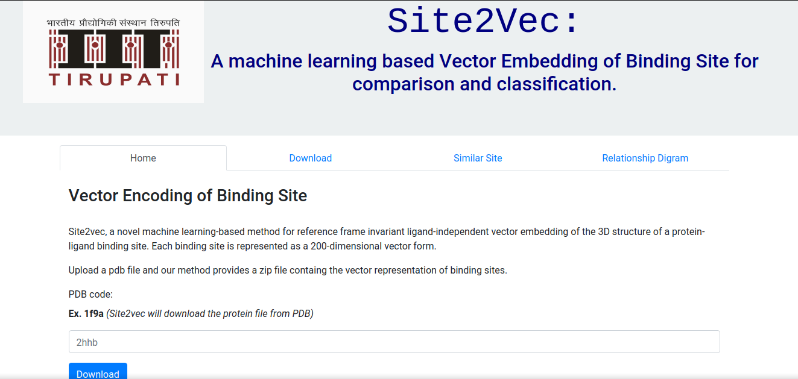

# Site2Vec
### Site2vec, a novel machine learning-based method for reference frame invariant ligand-independent vector embedding of the 3D structure of a protein-ligand binding site. Each binding site is represented as a 200-dimensional vector form.

**1. Download Model From the link given below:**
https://drive.google.com/drive/folders/1OZ-Ox2pSohRdgRKoFJdmtw__OaccaSkj?usp=sharing

    1.1) Create a folder "**Model**" in directory /Site2Vec/gitHub/Site2VecWebService/ and save AutoEncoder.h5, Cluster.sav into it. 
  
    1.2) Create a folder "**File**" in directory /Site2Vec/gitHub/Site2VecWebService/ and save file.pkl into it.

**2. Environment**

    2.1) Python 3.6
    
    2.2) flask 1.1.1
    
    2.3) pandas 1.0.3
    
    2.4) pil 1.1.7
    
    2.5) jdk 1.8.0_232
    
    2.6) scikit-learn 0.22.1
    
    2.7) scipy 1.4.1
    
    2.8) tensorflow 2.1.0
    
    2.9) keras 2.3.1
    
    2.10) numpy 1.18.1
    
    2.11) matplotlib 3.1.3
    
**3. Run web service**

    Execute Site2Vec/gitHub/Site2VecWebService/upload.py
    
    Open a browser and paste http://127.0.0.1:5616/home. (It is executed in the local system. Web service will be hosted very soon)
    
    
  **4. Train Model**
  
    To train your model, run **Site2Vec** notebook and provide binding site folder path.
  

